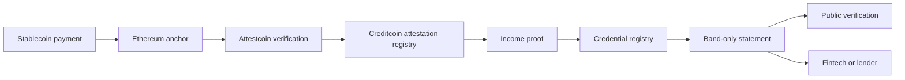

<div align="center">
  <picture>
    <source media="(prefers-color-scheme: dark)" srcset="./public/brand/orru-mark-reverse.svg">
    <source media="(prefers-color-scheme: light)" srcset="./public/brand/orru-mark.svg">
    
  </picture>

  <h1>Orru</h1>

  <p><strong>The missing layer between stablecoin income and credit.</strong></p>
  <p>
    Turn confirmed payment history into a portable, band-only income statement
    without publishing exact pay.
  </p>

  <p>
    <a href="https://orru.xyz">Website</a>
    ·
    <a href="https://orru.mintlify.site/">Documentation</a>
    ·
    <a href="https://orru.xyz/check">Public checker</a>
    ·
    <a href="https://creditcoin-testnet.blockscout.com">Creditcoin explorer</a>
  </p>

  <p>
    
    
    
    
  </p>
</div>

---

## What Orru does

Stablecoin payments are easy to inspect but difficult to use as credible income
evidence. A wallet history alone does not establish who paid, whether payments
belong to one employer, or whether the history was independently verified.

Orru converts confirmed payment periods into a reusable statement containing:

- an income range, never the individual payment amounts;
- the number of consecutive pay periods;
- the recognised payer;
- the evidence date and current statement status; and
- a public identifier that anyone can check without an Orru account.

The result can support income reviews, credit applications, and fintech
underwriting while keeping exact pay out of the issued credential.

## Why it is different

Orru separates discovery from verification:

- **FIND** uses indexers and explorers to locate possible inbound payments. It is
  a convenience layer and is never trusted as evidence.
- **PROVE** uses Attestcoin to authenticate Ethereum history on Creditcoin,
  checks the expected payer, and binds that evidence to the same commitment used
  by the income proof.

> Etherscan finds it. Attestcoin proves it. Creditcoin never takes anyone's word.

Two security invariants define the protocol:

1. **Trusted source:** authenticated events count only when they came from the
   expected payer or anchor contract.
2. **Same commitment:** the value authenticated by Attestcoin must be
   byte-identical to the public input accepted by the proof verifier.

## How it works



1. A payer sends a stablecoin payment or anchors a payment commitment on
   Ethereum.
2. A background process finds candidate payments and submits Attestcoin evidence
   to Creditcoin.
3. The application confirms wallet ownership and reads the already-verified
   income record.
4. The user reviews one payer's consecutive payment periods and authorises a
   band-only statement.
5. Orru's relayer submits the statement to Creditcoin, so the user signs but does
   not pay transaction fees.
6. Anyone with the statement ID can check its status and dated income range.

## Product surfaces

| Surface | Route | Purpose |
|---|---|---|
| Waitlist | `/` | Current public production entry point |
| Marketing | `/preview` | Product overview and use cases |
| Workspace | `/app` | Statement workflow dashboard |
| Connect | `/connect` | Connect and verify the payout account |
| Review | `/review` | Review confirmed periods and payer evidence |
| Profile | `/profile` | View the resulting income range |
| Credential | `/credential` | Authorise and issue a statement |
| Consent | `/consent` | Explicitly approve what is shared |
| Public checker | `/check` | Open a statement by short or full ID |
| Verification | `/verify/[id]` | Read live statement status from Creditcoin |
| Lender report | `/report/[id]` | Read-only decision and evidence view |

## Architecture

Orru spans two chains with deliberately different responsibilities.

### Ethereum Sepolia

Ethereum is the source of payment events and anchored commitments.

- `PayerAnchor` is the immutable trust root for off-chain payment commitments.
- `DemoPayroll` creates auditable ERC-20 payroll events for the demo.
- Attestcoin reads Ethereum only. Other chains are not accepted as source chains.

### Creditcoin testnet

Creditcoin stores authenticated commitments, verifies income proofs, issues
credentials, and hosts the demo credit pool.

- Network ID: `102031`
- RPC: `https://rpc.cc3-testnet.creditcoin.network`
- Explorer: [creditcoin-testnet.blockscout.com](https://creditcoin-testnet.blockscout.com)
- Native query verifier: `0x0000000000000000000000000000000000000FD2`

The Attestcoin source-chain key for Ethereum Sepolia is `1`. It is not the
Sepolia EVM chain ID (`11155111`).

### Application layer

The Next.js application provides:

- Privy-based wallet authentication;
- fixture-backed income and proof packages for the current demo flow;
- relayed credential issuance and credit disbursement APIs;
- live Creditcoin reads for public verification;
- public lender reports and explicit sharing consent; and
- a responsive consumer workspace and marketing site.

## Repository structure

```text
orru/
├── src/
│   ├── app/                  Next.js pages and API routes
│   ├── components/           product, marketing, brand, and UI components
│   └── lib/                  auth, chain clients, issue, verify, and data logic
├── public/
│   ├── brand/                Orru logo exports
│   └── textures/             landing-page visual assets
├── contracts/
│   ├── src/ethereum/         PayerAnchor and DemoPayroll
│   ├── src/attestcoin/       Attestcoin precompile integration
│   ├── test/                 Foundry tests
│   └── deployments/          canonical addresses keyed by chain ID
├── shared/                   commitment encoding and income bands
├── fixtures/                 verified snapshots and proof packages
├── worker/out/               fallback generated worker output
├── scripts/                  integration and live-read checks
└── docs/                     integration reference and project status
```

> [!NOTE]
> This branch contains the complete Next.js demo spine, Ethereum contracts,
> deployment records, frontend ABIs, and verified fixtures. Browser-side Noir
> proving artifacts, the worker source, and Creditcoin contract source packages
> are not included in this branch. The current issue flow therefore consumes a
> verified proof fixture rather than generating a proof in the browser.

## Technology

- **Frontend:** Next.js 16 App Router, React 19, TypeScript, Tailwind CSS 4
- **Wallets:** Privy
- **EVM client:** viem
- **Contracts:** Solidity 0.8.27, Foundry, OpenZeppelin
- **Verification:** Attestcoin native query verifier on Creditcoin
- **Privacy:** Noir proof system with a Barretenberg-generated Honk verifier
- **Networks:** Ethereum Sepolia and Creditcoin testnet

## Getting started

### Prerequisites

- Node.js 20 or newer
- npm
- A Privy application
- Ethereum Sepolia and Creditcoin testnet RPC endpoints
- Foundry, only if you are building or testing contracts

### Install the application

```bash
git clone https://github.com/wamimi/orru.git
cd orru
npm install
cp .env.example .env.local
npm run dev
```

On Windows PowerShell, replace the copy command with:

```powershell
Copy-Item .env.example .env.local
```

Open [http://localhost:3000](http://localhost:3000).

The root route is the waitlist. Use `/preview` for the marketing site and
`/connect` to start the product flow.

### Environment variables

Copy `.env.example` and configure only the services you need.

| Group | Variables |
|---|---|
| Wallet authentication | `NEXT_PUBLIC_PRIVY_APP_ID`, `PRIVY_APP_SECRET`, `SESSION_SECRET` |
| Chain access | `SEPOLIA_RPC_URL`, `CREDITCOIN_RPC_URL` |
| Relayed writes | `RELAYER_PRIVATE_KEY` |
| Waitlist webhook | `WAITLIST_WEBHOOK_URL` |
| Waitlist email | `WAITLIST_NOTIFY_EMAIL`, `RESEND_API_KEY`, `WAITLIST_FROM_EMAIL` |
| Payroll tooling | `USDC_ADDRESS`, `PAYER_ANCHOR_ADDRESS`, `DEMO_PAYROLL_ADDRESS`, `PAYROLL_OWNER`, `PAYROLL_KEEPER`, `PERIOD_SECONDS`, `SOURCE_CHAIN_KEY` |

Never expose `PRIVY_APP_SECRET`, `SESSION_SECRET`, or `RELAYER_PRIVATE_KEY` to
client code, logs, documentation, or chat.

### Build and quality checks

```bash
npm run lint
npm run check-copy
node scripts/test-integration.mjs
npm run build
```

`check-copy` protects the consumer vocabulary from leaking protocol
implementation terms into product screens.

### Build and test contracts

```bash
cd contracts
npm install
forge build
forge test
forge build --sizes
```

The Foundry configuration is load-bearing:

- Solidity `0.8.27`
- optimizer enabled with `optimizer_runs = 1`
- `bytecode_hash = "none"`
- `via_ir = false`

Changing these values requires a complete verifier compatibility test.

## API overview

| Method | Endpoint | Access | Purpose |
|---|---|---|---|
| `POST` | `/api/waitlist` | Public | Register a waitlist signup |
| `GET` | `/api/auth/challenge` | Public | Create a wallet ownership challenge |
| `POST` | `/api/auth/verify` | Public | Verify the signature and create a session |
| `POST` | `/api/auth/logout` | Session | Clear the current session |
| `GET` | `/api/income/[address]` | Session | Read income rows for the authenticated wallet |
| `GET` | `/api/slips/[address]` | Session | Read private payment-slip input when available |
| `GET` | `/api/credential/prepare` | Session | Prepare proof data and typed-data fields |
| `POST` | `/api/credential/issue` | Session | Relay credential issuance to Creditcoin |
| `POST` | `/api/share/[requestId]/consent` | Session | Record explicit sharing consent |
| `GET` | `/api/verify/[id]` | Public | Read public credential status |
| `GET` | `/api/report/[id]` | Public | Read the lender-facing report |
| `POST` | `/api/credit/disburse` | Session | Relay a demo credit disbursement |

## Live deployments

Canonical addresses live in `contracts/deployments/<chain-id>.json`. Application
code imports those files directly instead of duplicating addresses.

### Creditcoin testnet · `102031`

| Contract | Address |
|---|---|
| CredentialRegistry | [`0xc469…a8481`](https://creditcoin-testnet.blockscout.com/address/0xc4694C8db29C668Bebb2502664228156F11a8481) |
| AttestationRegistry | [`0x4717…e60C`](https://creditcoin-testnet.blockscout.com/address/0x47172643d148300d2649C475d68a5bD49267e60C) |
| DemoCreditPool | [`0x1B90…e9e`](https://creditcoin-testnet.blockscout.com/address/0x1B906254Ceca488c301E7063d437c8B18da10e9e) |
| mUSDC | [`0xD3a8…6B3d`](https://creditcoin-testnet.blockscout.com/address/0xD3a8Fd44b63890d518d15e3efECfA11a71276B3d) |
| IncomeVerifier | [`0x9c9C…e593`](https://creditcoin-testnet.blockscout.com/address/0x9c9C73aC2de017A47aF61b742147ee3f22a5e593) |
| NullifierRegistry | [`0x8750…E1D`](https://creditcoin-testnet.blockscout.com/address/0x8750311a947B6DC775C053904b106B57028fFE1D) |

### Ethereum Sepolia · `11155111`

| Contract | Address |
|---|---|
| PayerAnchor | [`0x16Ea…B7d2`](https://sepolia.etherscan.io/address/0x16EaB9DA91D2AEea1F1138A95E42C37d1D47B7d2) |
| DemoPayroll | [`0xD3a8…6B3d`](https://sepolia.etherscan.io/address/0xD3a8Fd44b63890d518d15e3efECfA11a71276B3d) |
| DemoUSDC | [`0xc469…a8481`](https://sepolia.etherscan.io/address/0xc4694C8db29C668Bebb2502664228156F11a8481) |

Both demo tokens use six decimals.

## Security model

- Exact payment amounts never enter an issued statement.
- A credential is scoped to one payer. Income from separate payers is never
  merged.
- Wallet ownership uses a free signed challenge.
- Credential issuance uses a separate EIP-712 authorisation bound to the proof,
  public inputs, payer, document hash, nonce, and deadline.
- Public verification renders from registry status, including a distinct revoked
  state.
- Relayed writes follow checks-effects-interactions and the user never gives Orru
  permission to move wallet funds.
- Credentials describe a dated historical window. They do not guarantee future
  income, affordability, legal eligibility, or repayment.

## Current status

Implemented in the current application:

- wallet connection and ownership verification;
- multi-payer income review with evidence links;
- band-only profile and statement preview;
- relayed credential issuance using verified fixture packages;
- explicit sharing consent;
- public statement verification and lender reports; and
- a disbursement API for the Creditcoin demo pool.

Work still in progress:

- generating Noir proofs in the browser instead of loading fixture packages;
- adding a user-facing disbursement experience;
- adding a credential revocation interface; and
- restoring the worker, circuit, and complete Creditcoin contract sources to
  this branch.

See [`docs/STATUS.md`](./docs/STATUS.md) for the detailed implementation audit.

## Documentation

- [Product documentation](https://orru.mintlify.site/)
- [Frontend and contract integration](./docs/FRONTEND-INTEGRATION.md)
- [Implementation status](./docs/STATUS.md)
- [Contract workspace](./contracts/README.md)
- [Fixture and proof-package guide](./fixtures/README.md)
- [Contributor and agent rules](./AGENTS.md)

## Contributing

Before opening a change:

1. Read `AGENTS.md`, especially the FIND/PROVE boundary and the trusted-source
   and same-commitment invariants.
2. Keep consumer copy focused on payout accounts, statements, verified payers,
   and income ranges.
3. Add tests with every Solidity contract change.
4. Run the relevant application, integration, and Foundry checks.
5. Never commit private keys, salts, session secrets, or raw payment slips.

## Acknowledgements

Orru is built with [Creditcoin](https://creditcoin.org/),
[Attestcoin](https://docs.creditcoin.org/), [Noir](https://noir-lang.org/), and
[OpenZeppelin](https://www.openzeppelin.com/).
