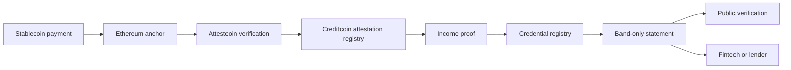

<div align="center">
  <picture>
    <source media="(prefers-color-scheme: dark)" srcset="./public/brand/orru-mark-reverse.svg">
    <source media="(prefers-color-scheme: light)" srcset="./public/brand/orru-mark.svg">
    
  </picture>

  <h1>Orru</h1>

  <p><strong>The missing layer between stablecoin income and credit.</strong></p>
  <p>
    Turn confirmed payment history into a portable, band-only income statement
    without publishing exact pay.
  </p>

  <p>
    <a href="https://orru.xyz">Website</a>
    ·
    <a href="https://orru.mintlify.site/">Documentation</a>
    ·
    <a href="https://orru.xyz/check">Public checker</a>
    ·
    <a href="https://creditcoin-testnet.blockscout.com">Creditcoin explorer</a>
  </p>

  <p>
    
    
    
    
  </p>
</div>

---

## What Orru does

Stablecoin payments are easy to inspect but difficult to use as credible income
evidence. A wallet history alone does not establish who paid, whether payments
belong to one employer, or whether the history was independently verified.

Orru converts confirmed payment periods into a reusable statement containing:

- an income range, never the individual payment amounts;
- the number of consecutive pay periods;
- the recognised payer;
- the evidence date and current statement status; and
- a public identifier that anyone can check without an Orru account.

The result can support income reviews, credit applications, and fintech
underwriting while keeping exact pay out of the issued credential.

## Verification, not trust

Orru separates discovery from verification:

- **FIND** uses indexers and explorers to locate possible inbound payments. It is
  a convenience layer and is never trusted as evidence.
- **PROVE** uses Attestcoin to authenticate Ethereum history on Creditcoin,
  checks the expected payer, and binds that evidence to the same commitment used
  by the income proof.

> Etherscan finds it. Attestcoin proves it. Creditcoin never takes anyone's word.

Two security invariants define the protocol:

1. **Trusted source:** authenticated events count only when they came from the
   expected payer or anchor contract.
2. **Same commitment:** the value authenticated by Attestcoin must be
   byte-identical to the public input accepted by the proof verifier.

## How it works



1. A payer either sends an ERC-20 payment on Ethereum or anchors a commitment to
   an off-chain payment record there.
2. A background process finds candidate payments and submits Attestcoin evidence
   to Creditcoin.
3. The application confirms wallet ownership and reads the already-verified
   income record.
4. The user reviews one payer's consecutive payment periods and authorises a
   band-only statement.
5. Orru's relayer submits the statement to Creditcoin, so the user signs but does
   not pay transaction fees.
6. Anyone with the statement ID can check its status and dated income range.

## How Attestcoin, Creditcoin and zero-knowledge proofs are used

Stated plainly, because each one does a specific job and none of them is
decorative. The full technical walkthrough of the Attestcoin integration, with
code pointers and transactions to open, is at
[orru.mintlify.site/attestcoin](https://orru.mintlify.site/attestcoin).

### Attestcoin authenticates the Ethereum evidence

Attestcoin authenticates Ethereum transactions on Creditcoin. Our worker fetches
a proof bundle for the source transaction from the Attestcoin prover service and
submits it to `AttestationRegistry`, which calls the **native query verifier
precompile at `0x0000000000000000000000000000000000000FD2`**. The precompile
checks the transaction against attested Ethereum history and returns the
authenticated receipt. For Demo Payroll, that receipt contains the ERC-20
transfer. For Semuni, it contains the approved payer's commitment and does not
independently prove an off-chain bank transfer.

Two things the precompile does *not* do, which our contract does on top:

- **It proves inclusion, not success.** A reverted transaction is still
  included. `AttestationRegistry` checks the receipt status itself.
- **It proves the event exists, not who emitted it.** The contract additionally
  requires `log.address == TRUSTED_ANCHOR` and that the payer in `topics[1]` is
  approved. Without this, anyone could emit a lookalike event, get a genuine
  proof for it, and be accepted.

Source-chain keys are not EVM chain ids: Ethereum Sepolia is key `1`, mainnet is
key `3`.

### Zero-knowledge proves the income band without the amount

A Noir circuit takes the three payments' amounts, periods and salts as **private
witness**, recomputes each `keccak256(abi.encode(recipient, amount, period,
salt))` commitment, and proves that every amount falls inside one of ten income
bands and the periods are consecutive. The **public inputs** are the recipient,
the band, and the three commitments. Nothing else.

Proving runs in the user's browser with bb.js in a Web Worker, and the private
witness is never sent to a remote proving service. In the current demo, an
authenticated Orru route delivers or derives the private slip before the browser
proves it. Exact amounts and salts are not published on-chain, included in the
credential or shown to a lender. A Barretenberg-generated UltraHonk verifier on
Creditcoin checks the proof on-chain.

### Creditcoin is where the statement lives and where money moves

`CredentialRegistry` on Creditcoin issues a statement only when three things hold
at once: every commitment in the proof's public inputs was accepted by
`AttestationRegistry` for the named payer, the zero-knowledge proof verifies
against those exact same commitments, and the subject signed an EIP-712
authorization. That last check is what stops someone issuing a statement for an
address they don't control.

`DemoCreditPool` then releases funds against a valid statement. Reads are
permissionless: anyone can verify a statement with two contract calls and no
account.

## What is real and what is simulated

Every proof, attestation and contract call is real and on public testnets. The
following are demo stand-ins, and are labelled as such wherever a user sees them.

| Thing | Status | Why |
|---|---|---|
| **Payments** | Simulated | `DemoPayroll` on Sepolia pays seven demo workers in **dUSD**, a test token we deployed, once an hour. The transfers are still real ERC-20 transfers in real blocks, and Attestcoin authenticates them identically. Semuni's off-chain payment records are demo data whose commitments are anchored on Ethereum. |
| **The private payer** | Simulated | **Semuni** is a payer address we control that anchors commitments for off-chain payments. It demonstrates the production model: pay by any rail, anchor only a hash. The salaries it anchors are demo figures. |
| **The credit pool** | Simulated | `DemoCreditPool` holds **mUSDC**, a test token, and lends 30% of the band floor. No repayment, no interest, no collections. It exists so an approved decision moves real value on-chain. |
| **The demo faucet** | Simulated | `/try` lets any wallet claim a three-period income history: a payer we control anchors three commitments for that address. This exists so a judge can complete the flow without being on a payroll. |
| **Attestation** | **Real** | Every commitment is authenticated by Creditcoin's precompile against attested Ethereum history. |
| **Proofs** | **Real** | Generated in the browser, verified on-chain by the deployed UltraHonk verifier. |
| **Statements and payouts** | **Real** | On Creditcoin, readable by anyone, moved by the pool contract. |

The point: what is simulated is the *economics*: who pays whom, and with what.
What is real is the *verification path*: Ethereum transaction authentication,
approved-payer and trusted-source checks, same-commitment binding, the
zero-knowledge band proof and the Creditcoin statement. For an anchored off-chain
payment, the initial assertion still comes from the approved payer.

## Product surfaces

| Surface | Route | Purpose |
|---|---|---|
| Landing | `/` | Product overview and use cases |
| Waitlist | `/waitlist` | Email signup |
| Workspace | `/app` | Statement workflow dashboard |
| Demo faucet | `/try` | Create a three-period test history for any wallet |
| Connect | `/connect` | Connect and verify the payout account |
| Review | `/review` | Review confirmed periods and payer evidence |
| Profile | `/profile` | View the resulting income range |
| Credential | `/credential` | Authorise and issue a statement |
| Consent | `/consent` | Explicitly approve what is shared |
| Public checker | `/check` | Open a statement by short or full ID |
| Verification | `/verify/[id]` | Read live statement status from Creditcoin |
| Lender report | `/report/[id]` | Read-only decision and evidence view |
| Borrow | `/borrow` | Draw testnet mUSDC against a valid statement |

## Architecture

Orru spans two chains with deliberately different responsibilities.

### Ethereum Sepolia

Ethereum is the source of payment events and anchored commitments.

- `PayerAnchor` is the immutable trust root for off-chain payment commitments.
- `DemoPayroll` creates auditable ERC-20 payroll events for the demo.
- Attestcoin reads Ethereum only. Other chains are not accepted as source chains.

### Creditcoin testnet

Creditcoin stores authenticated commitments, verifies income proofs, issues
credentials, and hosts the demo credit pool.

- Network ID: `102031`
- RPC: `https://rpc.cc3-testnet.creditcoin.network`
- Explorer: [creditcoin-testnet.blockscout.com](https://creditcoin-testnet.blockscout.com)
- Native query verifier: `0x0000000000000000000000000000000000000FD2`

The Attestcoin source-chain key for Ethereum Sepolia is `1`. It is not the
Sepolia EVM chain ID (`11155111`).

### Application layer

The Next.js application provides:

- Privy-based wallet authentication;
- live-chain income derivation for Demo Payroll and authenticated private-slip
  delivery for anchored Semuni records;
- relayed credential issuance and credit disbursement APIs;
- live Creditcoin reads for public verification;
- public lender reports and explicit sharing consent; and
- a responsive consumer workspace and marketing site.

## Repository structure

```text
orru/
├── src/
│   ├── app/                  Next.js pages and API routes
│   ├── components/           product, marketing, brand, and UI components
│   └── lib/                  auth, chain clients, issue, verify, and data logic
├── public/
│   ├── brand/                Orru logo exports
│   └── textures/             landing-page visual assets
├── contracts/
│   ├── src/ethereum/         PayerAnchor and DemoPayroll
│   ├── src/attestcoin/       Attestcoin precompile integration
│   ├── test/                 Foundry tests
│   └── deployments/          canonical addresses keyed by chain ID
├── shared/                   commitment encoding and income bands
├── fixtures/                 verified snapshots and proof packages
├── worker/out/               fallback generated worker output
├── scripts/                  integration and live-read checks
└── docs/                     integration reference and project status
```

## Technology

- **Frontend:** Next.js 16 App Router, React 19, TypeScript, Tailwind CSS 4
- **Wallets:** Privy
- **EVM client:** viem
- **Contracts:** Solidity 0.8.27, Foundry, OpenZeppelin
- **Verification:** Attestcoin native query verifier on Creditcoin
- **Privacy:** Noir proof system with a Barretenberg-generated Honk verifier
- **Networks:** Ethereum Sepolia and Creditcoin testnet

## Getting started

### Prerequisites

- Node.js 20 or newer
- npm
- A Privy application
- Ethereum Sepolia and Creditcoin testnet RPC endpoints
- Foundry, only if you are building or testing contracts

### Install the application

```bash
git clone https://github.com/wamimi/orru.git
cd orru
npm install
cp .env.example .env.local
npm run dev
```

On Windows PowerShell, replace the copy command with:

```powershell
Copy-Item .env.example .env.local
```

Open [http://localhost:3000](http://localhost:3000).

The root route is the landing page. Use `/waitlist` for the signup form and
`/connect` to start the product flow.

### Environment variables

Copy `.env.example` and configure only the services you need.

| Group | Variables |
|---|---|
| Wallet authentication | `NEXT_PUBLIC_PRIVY_APP_ID`, `PRIVY_APP_SECRET`, `SESSION_SECRET` |
| Chain access | `SEPOLIA_RPC_URL`, `CREDITCOIN_RPC_URL` |
| Relayed writes | `RELAYER_PRIVATE_KEY` |
| Private Semuni demo slips | `ORRU_SLIP_BOOKS` |
| Demo faucet | `ORRU_FAUCET_SECRET`, `ORRU_FAUCET_PAYER`, `ORRU_FAUCET_PAYER_KEY` |
| Browser proving | `PROOF_BUILDER_URL`, `ORRU_COEP`, `NEXT_PUBLIC_ORRU_PREBUILT` |
| Waitlist webhook | `WAITLIST_WEBHOOK_URL` |
| Waitlist email | `WAITLIST_NOTIFY_EMAIL`, `RESEND_API_KEY`, `WAITLIST_FROM_EMAIL` |
| Payroll tooling | `USDC_ADDRESS`, `PAYER_ANCHOR_ADDRESS`, `DEMO_PAYROLL_ADDRESS`, `PAYROLL_OWNER`, `PAYROLL_KEEPER`, `PERIOD_SECONDS`, `SOURCE_CHAIN_KEY` |

Never expose `PRIVY_APP_SECRET`, `SESSION_SECRET`, `RELAYER_PRIVATE_KEY`,
`ORRU_SLIP_BOOKS`, `ORRU_FAUCET_SECRET`, or `ORRU_FAUCET_PAYER_KEY` to client
code, logs, documentation, or chat. `ORRU_FAUCET_SECRET` must remain stable after
claims are created; changing it makes their private preimages unrecoverable.

### Build and quality checks

```bash
npm run lint
npm run check-copy
node scripts/test-integration.mjs
npm run build
```

`check-copy` protects the consumer vocabulary from leaking protocol
implementation terms into product screens.

### Build and test contracts

```bash
cd contracts
npm install
forge build
forge test
forge build --sizes
```

The Foundry configuration is load-bearing:

- Solidity `0.8.27`
- optimizer enabled with `optimizer_runs = 1`
- `bytecode_hash = "none"`
- `via_ir = false`

Changing these values requires a complete verifier compatibility test.

## API overview

| Method | Endpoint | Access | Purpose |
|---|---|---|---|
| `POST` | `/api/waitlist` | Public | Register a waitlist signup |
| `GET` | `/api/auth/challenge` | Public | Create a wallet ownership challenge |
| `POST` | `/api/auth/verify` | Public | Verify the signature and create a session |
| `POST` | `/api/auth/logout` | Session | Clear the current session |
| `GET` | `/api/income/[address]` | Session | Read income rows for the authenticated wallet |
| `GET` | `/api/slips/[address]` | Session | Read private payment-slip input when available |
| `GET`/`POST` | `/api/credential/prepare` | Session | Read a prepared demo or validate browser proof data and prepare typed data |
| `POST` | `/api/credential/issue` | Session | Relay credential issuance to Creditcoin |
| `POST` | `/api/faucet/claim` | Session | Anchor a demo income history for the authenticated wallet |
| `GET` | `/api/faucet/status/[address]` | Session | Read that wallet's anchor and attestation progress |
| `GET` | `/api/statements/[address]` | Session | Read live statements for the authenticated wallet |
| `POST` | `/api/share/[requestId]/consent` | Session | Record explicit sharing consent |
| `GET` | `/api/verify/[id]` | Public | Read public credential status |
| `GET` | `/api/report/[id]` | Public | Read the lender-facing report |
| `POST` | `/api/credit/disburse` | Session | Relay a demo credit disbursement |
| `GET` | `/api/credit/status/[txHash]` | Session | Read the submitted disbursement's receipt status |

## Live deployments

Canonical addresses live in `contracts/deployments/<chain-id>.json`. Application
code imports those files directly instead of duplicating addresses.

### Creditcoin testnet · `102031`

| Contract | Address |
|---|---|
| CredentialRegistry | [`0xc469…a8481`](https://creditcoin-testnet.blockscout.com/address/0xc4694C8db29C668Bebb2502664228156F11a8481) |
| AttestationRegistry | [`0x4717…e60C`](https://creditcoin-testnet.blockscout.com/address/0x47172643d148300d2649C475d68a5bD49267e60C) |
| DemoCreditPool | [`0x1B90…e9e`](https://creditcoin-testnet.blockscout.com/address/0x1B906254Ceca488c301E7063d437c8B18da10e9e) |
| mUSDC | [`0xD3a8…6B3d`](https://creditcoin-testnet.blockscout.com/address/0xD3a8Fd44b63890d518d15e3efECfA11a71276B3d) |
| IncomeVerifier | [`0x9c9C…e593`](https://creditcoin-testnet.blockscout.com/address/0x9c9C73aC2de017A47aF61b742147ee3f22a5e593) |
| NullifierRegistry | [`0x8750…E1D`](https://creditcoin-testnet.blockscout.com/address/0x8750311a947B6DC775C053904b106B57028fFE1D) |

### Ethereum Sepolia · `11155111`

| Contract | Address |
|---|---|
| PayerAnchor | [`0x16Ea…B7d2`](https://sepolia.etherscan.io/address/0x16EaB9DA91D2AEea1F1138A95E42C37d1D47B7d2) |
| DemoPayroll | [`0xD3a8…6B3d`](https://sepolia.etherscan.io/address/0xD3a8Fd44b63890d518d15e3efECfA11a71276B3d) |
| DemoUSDC | [`0xc469…a8481`](https://sepolia.etherscan.io/address/0xc4694C8db29C668Bebb2502664228156F11a8481) |

Both demo tokens use six decimals.

## On-chain record

Everything below is a real transaction on a public testnet, made while building
and testing this submission. Open any of them.

### Deployments

| Contract | Chain | Creation transaction |
|---|---|---|
| EvmV1Decoder (library) | Creditcoin, block 5436625 | [`0x152105…41f8d1`](https://creditcoin-testnet.blockscout.com/tx/0x15210532924cc4149afef0dfc0782c5a15d6fa46073a901362b51f4d9541f8d1) |
| ZKTranscriptLib (library) | Creditcoin, block 5436639 | [`0xfcf826…6b797c`](https://creditcoin-testnet.blockscout.com/tx/0xfcf826b9eaefa96f2bbe203cc17c092cc278acaf1cbf6f75dbda0b0a4e6b797c) |
| IncomeVerifier | Creditcoin, block 5436640 | [`0xa6f5c8…3c8165`](https://creditcoin-testnet.blockscout.com/tx/0xa6f5c8c090a1258fe2a857d851cb0badcd23f61331505785aa8c1eb9ad3c8165) |
| AttestationRegistry | Creditcoin, block 5436641 | [`0x8e4d40…3ed3d44`](https://creditcoin-testnet.blockscout.com/tx/0x8e4d402b9c834b2f3e4e0ab9a365661707266d5daf6de55ce63c642ad3ed3d44) |
| NullifierRegistry | Creditcoin, block 5436654 | [`0x686c84…15ecbd`](https://creditcoin-testnet.blockscout.com/tx/0x686c84139b87f9ba2a65e81b5d72c1d57a090159bd629f8a943251625315ecbd) |
| CredentialRegistry | Creditcoin, block 5436656 | [`0x9f23b4…ceea5e8`](https://creditcoin-testnet.blockscout.com/tx/0x9f23b4e0cec28c27561bb554eff165b3f3364075d63d4723825e6f021ceea5e8) |
| mUSDC | Creditcoin, block 5436657 | [`0xaa38e2…31b6357`](https://creditcoin-testnet.blockscout.com/tx/0xaa38e23e5316196636f6281ee93aad90ec37fc2a02b5ae7834974995531b6357) |
| DemoCreditPool | Creditcoin, block 5436658 | [`0xd6a64f…be0a0de`](https://creditcoin-testnet.blockscout.com/tx/0xd6a64f9b595f712265b7ddd3c459e2c1eacd6e90d7eb9fee26b5c8a2ebe0a0de) |
| PayerAnchor | Sepolia, block 11605464 | [`0x0e358b…226605b`](https://sepolia.etherscan.io/tx/0x0e358bf6c900086be7f6c50af7707c5d649931b9f884d6d275e12acb3226605b) |
| DemoUSDC | Sepolia, block 11626539 | [`0x3f4b86…5cba406`](https://sepolia.etherscan.io/tx/0x3f4b86e73381209ab0798462d534cd80ea57fc0794bac7aee73c199f75cba406) |
| DemoPayroll | Sepolia, block 11626539 | [`0x5f0914…2365209`](https://sepolia.etherscan.io/tx/0x5f09149e644c0215a9f8d23268d4af88b5fe4ac59d2447b3dde9792d82365209) |

### Payments and anchors on Ethereum

| What | Transaction |
|---|---|
| Semuni anchors a three-period window for an existing wallet | [`0xfd96ea…89df1cbf`](https://sepolia.etherscan.io/tx/0xfd96eaf394b69a08fb6a0a080af3de3a034be57cc6cb66deb2b4222c89df1cbf) (block 11646662) |
| Semuni anchors a demo-faucet claim for a fresh wallet | [`0xd359d8…613bcdbf`](https://sepolia.etherscan.io/tx/0xd359d8b2ac627d63662c5e04ee929d1f6ef8a5c2a0b74437c75240c7613bcdbf) (block 11688412) |
| DemoPayroll pays seven workers every hour; latest run at the time of writing | [`0xc64ef2…1ca1e01`](https://sepolia.etherscan.io/tx/0xc64ef21041d5d47dc1840c3ae599df5fe3ff146d5063e83dc6461405a1ca1e01) (block 11688374), 81 transactions on the [contract](https://sepolia.etherscan.io/address/0xD3a8Fd44b63890d518d15e3efECfA11a71276B3d) |

### Attestations on Creditcoin

`AttestationRegistry.execute` has been called more than sixty times, first by the
deployer and then by the unattended relayer (`0x1BEBB5EF…bC217`). Each call
submits an Attestcoin proof to the native query verifier and records the
accepted commitments. Two to follow:

| What | Transaction |
|---|---|
| Accepts the existing wallet's Semuni window (anchor `0xfd96ea…` above) | [`0x497430…83e5fd0`](https://creditcoin-testnet.blockscout.com/tx/0x49743077937e997117c5d690ac022c41ae11fb3b5216be21063433fa883e5fd0) (block 5440620) |
| Accepts the fresh wallet's faucet claim (anchor `0xd359d8…` above), relayed by the cron | [`0x127c9f…238019b`](https://creditcoin-testnet.blockscout.com/tx/0x127c9fd2f49de5459b9cff72b3dd3af49c7df69941bbda097d4efe503238019b) (block 5474663) |

The full list is on [Blockscout](https://creditcoin-testnet.blockscout.com/address/0x47172643d148300d2649C475d68a5bD49267e60C).

### Statements issued

| Subject | Payer | Band | Statement | Transaction |
|---|---|---|---|---|
| `0xf6A48D18…0b66C` | Demo Payroll | 4 | `orru:cred:7b6a24eb` | [`0x320693…1122d260`](https://creditcoin-testnet.blockscout.com/tx/0x32069376dc7690c063ad90630a2b52a1f8d363866cda0f9926f787fd1122d260) (block 5442366) |
| `0xe058c205…3b34` | Demo Payroll | 5 | `orru:cred:55c29575` | [`0x9c4bd8…3614d576`](https://creditcoin-testnet.blockscout.com/tx/0x9c4bd8179f88dd793c4933fc456df16b8647a837b8df73fb5daa63f53614d576) (block 5451868) |
| `0xBb605cf7…E75A` | Semuni | 6 | `orru:cred:576b974c` | [`0xb5f78f…902d4ab`](https://creditcoin-testnet.blockscout.com/tx/0xb5f78f3db90a4e700ce8e24054ececcf83f77978f80f682bc8f0c6aae902d4ab) (block 5474351) |
| `0x57409fb0…ab41` (demo faucet) | Semuni | 6 | `orru:cred:b9e81cf2` | [`0xe02242…8650c8`](https://creditcoin-testnet.blockscout.com/tx/0xe022428a9d2bab2322ff270d9d20cb4a398ae290da1ea11bfb5d7ac5568650c8) (block 5474877) |

Each one is readable at `https://orru.xyz/verify/<statement>` without an account,
or with two calls to `CredentialRegistry` as described in the docs.

### Credit drawn

| Recipient | Amount | Transaction |
|---|---|---|
| `0xf6A48D18…0b66C` | 25 mUSDC | [`0xda13d2…c2f4233`](https://creditcoin-testnet.blockscout.com/tx/0xda13d2bc15e0db08654e0f5b486cc4b80f92ef378e5de04fc25b8f701c2f4233) (block 5445923) |
| `0xe058c205…3b34` | 1,200 mUSDC | [`0xd7bf66…ddf5bc0`](https://creditcoin-testnet.blockscout.com/tx/0xd7bf66017e96c33090a4213bedba835e4647d6fb656ab5d118175cb43ddf5bc0) (block 5457474) |
| `0xBb605cf7…E75A` | 900 mUSDC | [`0x997275…db439c1`](https://creditcoin-testnet.blockscout.com/tx/0x99727560c5f7032bf7fa017bc37209eb77874bc84e0aa2a75750a0db5db439c1) (block 5474358) |
| `0x57409fb0…ab41` (demo faucet) | 450 mUSDC | [`0xd4237b…9ac52e6`](https://creditcoin-testnet.blockscout.com/tx/0xd4237bb4e5c045aab3532fa3e7157174e2ae0390adf7d93f33e9804dc9ac52e6) (block 5474900) |

The last two rows are the two paths walked end to end on 12 September 2026: an
existing wallet, and a fresh wallet that started from the demo faucet.

## How this makes money

Nobody pays to read a credential.

**Payer integration is the business.** A payroll platform or payout rail adds one
line to its flow to anchor a commitment per payment. Its workers can then prove
income anywhere. The payer gains a retention feature, and every worker they pay
becomes a user. Semuni in the demo is exactly this. It pays off-chain and
anchors only a hash.

**Underwriting.** "How much can this person safely borrow?" Subscription or
per-decision, sold to lenders who want a limit rather than a fact.

**Embedded credit.** Get-paid-early inside someone else's app. Origination fees.

**Reading a credential stays free and permissionless, permanently.** A
verification a lender can perform without asking us is a stronger product than
one they need a key for, and it is the reason the credential lives on Creditcoin
rather than in our database. We charge the side that gains distribution, never
the side that would otherwise have to trust us.

**We are not the balance sheet.** Production liquidity would come from the
payer's own float, a depositor pool, or a licensed credit partner. The deployed
pool uses disclosed testnet capital only.

## Security model

- Exact payment amounts never enter an issued statement.
- A credential is scoped to one payer. Income from separate payers is never
  merged.
- Wallet ownership uses a free signed challenge.
- Credential issuance uses a separate EIP-712 authorisation bound to the proof,
  public inputs, payer, document hash, nonce, and deadline.
- Public verification renders from registry status, including a distinct revoked
  state.
- Relayed writes follow checks-effects-interactions and the user never gives Orru
  permission to move wallet funds.
- Credentials describe a dated historical window. They do not guarantee future
  income, affordability, legal eligibility, or repayment.

## Current status

The current MVP flow is implemented and proven end to end on live testnets:

- wallet connection and ownership verification;
- multi-payer income review with per-period evidence links;
- band-only profile and statement preview;
- **proof generation in the user's own browser**: bb.js in a Web Worker; the
  witness stays inside the browser during proving and is not sent to a proving
  service;
- relayed credential issuance with an EIP-712 subject authorization;
- explicit sharing consent;
- public statement verification, short aliases, and lender reports;
- disbursement against a verified statement; real tokens have moved on
  Creditcoin; and
- an unattended relay that carries anchored payments to Creditcoin every few
  minutes.

Not built, deliberately:

- a credential revocation interface; revocation exists on the contract and the
  public page renders it; there is no screen for it;
- API keys, metering or billing; the verification endpoint is free and
  permissionless, and that is the product working as designed;
- real capital; the credit pool is disclosed as simulated;
- repayment; the pool records what each wallet has drawn and never asks for it
  back. See the roadmap below for how repayment closes the loop.

Both user paths were walked end to end against the deployed contracts on
12 September 2026: an existing wallet with payroll and Semuni history issued
statement `orru:cred:576b974c` and drew 900 mUSDC, and a fresh wallet went
through the demo faucet to a statement and a draw of its own.

The one timing constraint worth knowing: after a payment is anchored, Attestcoin
trails Ethereum by roughly seven minutes before it can be relayed, so a freshly
claimed demo history takes about ten minutes to become provable. That is the
protocol's cadence, not a queue.

## Testing as a judge

Nothing in the flow costs the tester anything: the demo payer pays Ethereum gas
and the relayer pays Creditcoin gas. A wallet only ever signs.

There are two ways to test. The prepared wallet is the fastest judge path. The
demo faucet is open to anyone and shows the complete protocol cadence.

| Path | Wallet | Initial wait | What it demonstrates |
|---|---|---|---|
| **Prepared judge wallet** | The wallets and keys provided with the DoraHacks submission | None | Review, browser proof, statement issuance, public verification and borrowing |
| **Demo faucet** | Use any fresh wallet you control | Usually 10 to 15 minutes | The complete flow, including Ethereum anchoring and Attestcoin confirmation |

### Fast judge path: prepared wallet

The prepared wallets already have three Semuni pay cycles confirmed by
Attestcoin. Their addresses and private keys are provided with the DoraHacks
submission. They are testnet accounts holding nothing of value; if one has been
used before you arrive, take the next one or use the demo faucet.

1. Import the supplied testnet account into MetaMask or Rabby.
2. Open [orru.xyz/connect](https://orru.xyz/connect), connect it and sign the
   short ownership message.
3. Review the confirmed Semuni income history and issue the statement.
4. Borrow against the statement. The mUSDC arrives in the connected wallet.
5. Open the public statement page in a private window. It needs no wallet or
   Orru account.

### Full protocol path: demo faucet

The faucet works with any fresh wallet. It does not send spendable funds on
Sepolia. Orru's demo payer anchors three recipient-specific income commitments
in one Sepolia transaction. Attestcoin then confirms those records against
Ethereum, and the relayer records the accepted commitments on Creditcoin.

1. Open [orru.xyz/try](https://orru.xyz/try) and choose **Create demo history**.
2. Connect any wallet you control and sign the short ownership message. The
   wallet needs no ETH, CTC or tokens.
3. Leave the page open while it checks progress. It shows when Ethereum confirms
   the transaction, the latest Ethereum block covered by Attestcoin, when the
   record is ready for Orru's relayer, and when Creditcoin accepts it. The normal
   wait is 10 to 15 minutes. If it is not ready after 25 minutes, check the
   latest `attest` workflow under GitHub Actions.
4. When the wallet has an income history, review Semuni, issue the statement and
   borrow against it.
5. Open the public statement page in a private window.

Why the wait exists: Attestcoin normally trails Ethereum by about seven minutes,
and Orru's relayer runs every five minutes. The page checks every 15 seconds, but
it cannot make either chain advance sooner. This wait applies only to a fresh
faucet claim, not to a prepared judge wallet.

**Seeing the mUSDC in your wallet.** MetaMask does not detect tokens on
Creditcoin testnet, so add it once, on the Creditcoin testnet network:

| Field | Value |
|---|---|
| Network | Creditcoin Testnet, chain id `102031`, RPC `https://rpc.cc3-testnet.creditcoin.network`, symbol `CTC`, explorer `https://creditcoin-testnet.blockscout.com` |
| Token address | `0xD3a8Fd44b63890d518d15e3efECfA11a71276B3d` |
| Symbol | `mUSDC` |
| Decimals | `6` |

In MetaMask: Tokens, Import tokens, Custom token, paste the address. Add it on
the Creditcoin network only; the same address on Sepolia is the payroll contract.
Token lists live in the wallet app, not in the account key, so an imported
account starts without it.

<!-- Judge wallets, if they must be listed here rather than in the submission:
address and private key, one per line. Testnet only. -->

The faucet spends real Sepolia gas from a server-side hot key. Its in-memory
duplicate guard protects only one process, not every Vercel instance. Before
long-lived public exposure, add a shared atomic rate limit, bot challenge and
global daily spend cap, and keep the payer key minimally funded.

## Roadmap

**Repayment.** Today a draw is a one-way transfer: `DemoCreditPool` records it
per wallet (`drawnBySubject`) and caps it at a share of the band floor. The next
contract adds `repay(credentialId, amount)`, a due date and a simple fee, paid in
the same token on Creditcoin. Repayment history then becomes part of what a
verifier can read: a statement with a draw in arrears says so on its public
page, and one that was repaid on time says that too. Repayments made on Ethereum
need no new protocol: a repayment anchored by the payer or the borrower is
attested by Attestcoin exactly like income is today.

**Creditcoin writability.** Attestcoin's write layer (Creditcoin to Ethereum)
is not live in this hackathon window. When it ships, two things move out of the
demo pool and onto the chains where users actually hold money: disbursing on
Ethereum or Base from a lender's own vault, triggered by an Outbox message that a
statement is valid; and pushing statement status changes (issued, revoked, in
arrears) to lender contracts on other chains. The receiver design is already
fixed in `AGENTS.md`: an adapter between the Inbox and the application, the
emitter address validated against a trusted set, replay protection left to the
protocol.

**Ethereum mainnet.** `PayerAnchor` and a second registry set on mainnet
(source chain key `3`), so real payroll platforms can anchor production
payments. The verifier, nullifier registry and circuit are reused unchanged.

**Payer SDK.** One package that anchors a commitment per payment and hands the
worker their slip, so a payout rail integrates in an afternoon.

## Documentation

- [Product documentation](https://orru.mintlify.site/)
- [How Orru uses Attestcoin](https://orru.mintlify.site/attestcoin)
- [Frontend and contract integration](./docs/FRONTEND-INTEGRATION.md)
- [Contract workspace](./contracts/README.md)
- [Fixture and proof-package guide](./fixtures/README.md)
- [Contributor and agent rules](./AGENTS.md)

## Contributing

Before opening a change:

1. Read `AGENTS.md`, especially the FIND/PROVE boundary and the trusted-source
   and same-commitment invariants.
2. Keep consumer copy focused on payout accounts, statements, verified payers,
   and income ranges.
3. Add tests with every Solidity contract change.
4. Run the relevant application, integration, and Foundry checks.
5. Never commit private keys, salts, session secrets, or raw payment slips.

## Acknowledgements

Orru is built with [Creditcoin](https://creditcoin.org/),
[Attestcoin](https://docs.creditcoin.org/), [Noir](https://noir-lang.org/), and
[OpenZeppelin](https://www.openzeppelin.com/).
